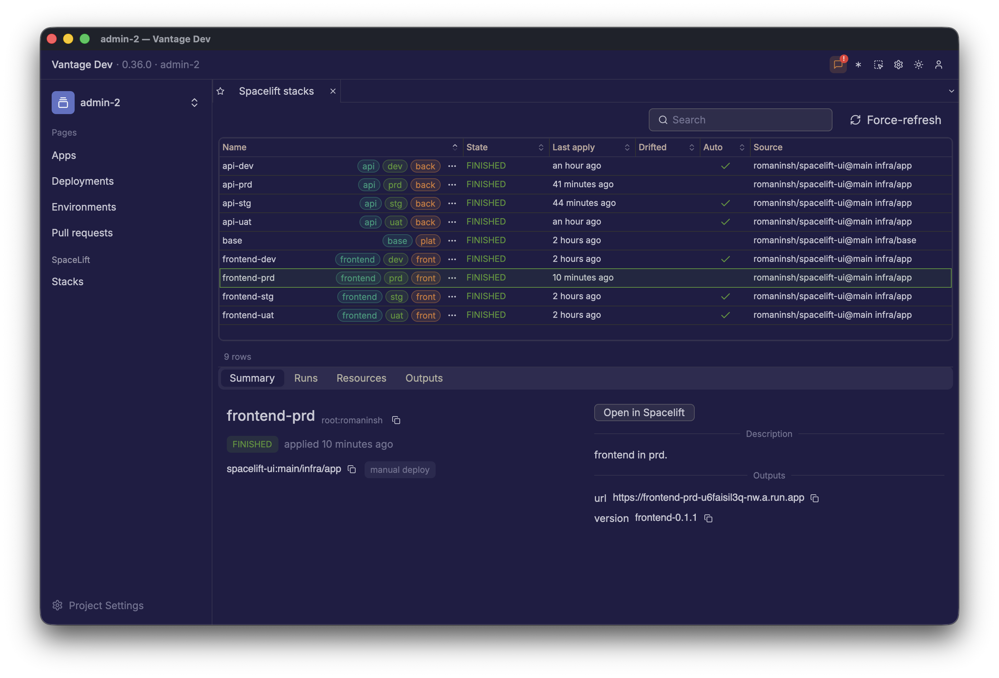
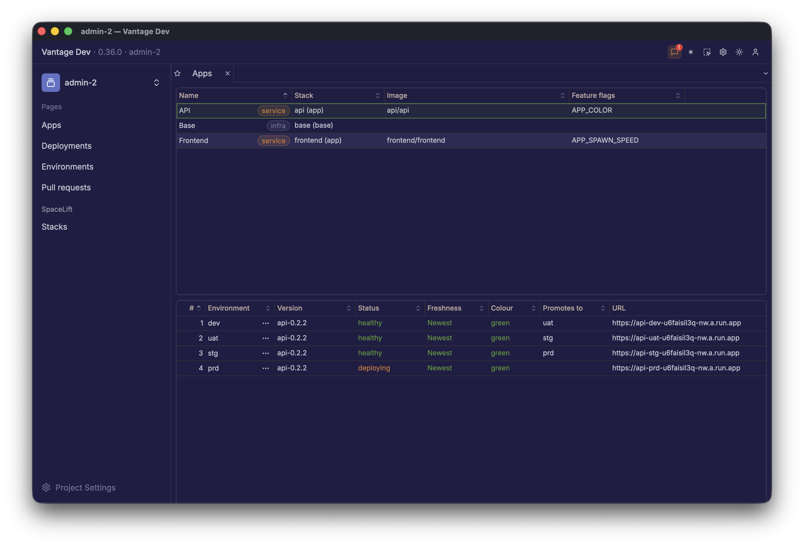

# spacelift-ui

This repository is a best practice for your own enterprise-grade build, deploy and promote setup. Here
are some of the features built in:

 1. fast cached docker builds.
 2. sharp separation between ci and cd.
 3. github only has dev promotion access.
 4. spacelift promotion scripts for multi-env release coordination.
 5. feature-flag support - both frontend and backend.
 6. vantage-ui wrapper for the UI.

## Resulting APP ui

Every stack across every environment, with its team, its state and what it builds from. Selecting one
opens a summary carrying its outputs and a link straight into Spacelift:

The apps view answers the other question - what is running where, how fresh it is, and what it
promotes to next:

Vantage UI (can be downloaded free from https://vantage-ui.com/) is a UI shell, which integrates at the
platform team access level. It works as a management console, but can also be used to deploy platform
API and expose custom promotion endpoints or integration with enterprise review and approval flow.

This platform backend is out of scope for this example repository.

## Applications, Monorepo and Local Development

There are multiple languages in the org, I included Rust and TypeScript, both compile into containers
and are eventually launched into GCP Cloud Run. In a larger org you orchestrate with ArgoCD project
sets, but the basic idea is similar.

If you want - you can deploy it - you'll need GCP and a free Spacelift account.

I included a Makefile - where you can just run `make dev` to build and run frontend/backend locally.
You would also want to run it in docker-compose: `make up`, just make sure the ports are free.

## PRs

In your PRs you want to run test suites. Some orgs want to build artifacts as part of the PR run;
here, for simplicity, I only do tests. Code is treated as source of truth - once something is merged
into main, a `release` pipeline will take versions, build and push artifacts, then tag the commit.

A pull request only runs the checks it touches, and only plans terraform against `dev` - the
environment its merge will actually land in. A single `conclude` check gathers the rest, so branch
protection has one thing to require and a skipped job can never satisfy it.

## Caching

I have included docker caching, both dependency caches and restoring caches from artifact
registry. When builds become complex, this saves a significant amount of time and makes engineering
teams happy.

## Safety

You would want to enable peer reviews and, with enforced version bumps, you can also loop in
validation for PR titles, merge squashes - whichever your organisation prefers.

Once code is changed it's considered source of truth, and will be promoted, rolled back, or
superseded by the next release.

## Permissions

Spacelift has stacks for every env * app combination. If your organisation has hundreds of apps and
4-5 envs, managing all this is difficult, so we introduce a simple rule - you can only push an app
version if it's already running in the environment below and that environment is healthy.

Both app versions and feature flag values are stored in Spacelift.

## Two release axes

An app release and an infrastructure release are separate things and move separately.

A stack's **pin** is the commit it runs terraform from. Its **deploy document** is the image digest
it runs. Application code lives in the image, never in the stack's checkout, so the two never need to
be the same commit.

Merging an app version bump builds the image, tags `api-1.2.3`, and moves dev's deploy document.
Merging a terraform change tags `base-0.2.0` and moves dev's pin. Neither touches the other, and
neither touches any environment above dev - a push policy makes sure of it, so what an environment
runs can never change because someone pushed.

Promotion then moves the **pair**, so an environment can only ever run a combination the one below it
actually ran. Feature flags are the exception: they are environment configuration and change freely,
at any time, on any environment.

## Terraform stacks

While I have included some basic stacks, you can create logic around feature flags or add more
features to the app deployment. This does not affect the basic principle of this example: start with
a simple concept, then grow it.

## appctl

This command is a wrapper designed for 2 things:

 - retrieve things from APIs and output as json.
 - execute version promotions safely.

Vantage UI supports a `cmd` backend, which is this app exactly. It will source your infrastructure
data and visualise it, but also provide interactivity.

## End-to-end walk

Clone this repo, then create stacks in your own Spacelift account, connect your GCP and deploy the
dev stack. Edit `apps.yaml` to configure your applications and environments.

Raise a PR - make sure tests pass, bump the version, merge. On merge the artifact should be deployed
if OIDC in base is configured correctly.

This should also trigger a `dev` stack deployment (for whichever app you changed the version of).

Open the frontend URL (you can find it in the GCP Cloud Run console), and you should see green
bubbles rising on the screen.

## Use Vantage UI

Download vantage-ui, open the `vantage-admin` folder and make sure your spacectl is authenticated. Run
`make spacelift-token` to mint the API token the Spacelift pages read. The UI should work out of the
box and you should be able to promote app versions and maybe even edit feature flags.

When you deploy a new `api` version, it should reflect on the frontend screen.
